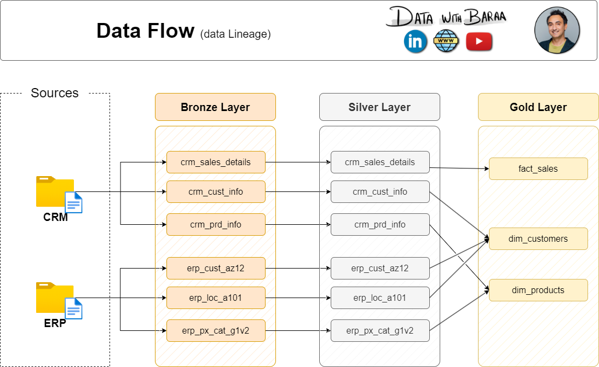

# Medallion Architecture Data Warehouse Project

A complete end-to-end data warehouse implementation using the **Medallion Architecture** pattern (Bronze → Silver → Gold layers) built with **Apache Airflow**, **dbt**, and **Snowflake**.

## 🏗️ Architecture Overview

This project demonstrates a modern data warehouse architecture that transforms raw data into analytics-ready datasets through three layers:

- **Bronze Layer**: Raw, unprocessed data ingested from source systems
- **Silver Layer**: Cleaned, standardized, and transformed data
- **Gold Layer**: Business-ready dimensional models and aggregated facts

<<<<<<< HEAD



=======
### Data Flow

>>>>>>> 6a7a52f3d3ac2dfb7b36078a85fbf31f95ceb849

## 🛠️ Technology Stack

- **Data Orchestration**: Apache Airflow 2.9 (Docker Compose)
- **Data Transformation**: dbt-snowflake 1.8
- **Data Warehouse**: Snowflake
- **Containerization**: Docker & Docker Compose
- **Programming**: Python 3.x

## 📁 Project Structure

```
Medallion-Architecture-Project/
├── airflow_medallion/          # Airflow orchestration
│   ├── dags/
│   │   └── sales_dwh_pipeline.py
│   ├── scripts/
│   │   ├── bronze_loader.py
│   │   └── validate_bronze.py
│   ├── config/dbt_profiles/
│   └── docker-compose.yml
├── datasets/                   # Sample source data
│   ├── source_crm/
│   │   ├── cust_info.csv
│   │   ├── prd_info.csv
│   │   └── sales_details.csv
│   └── source_erp/
│       ├── CUST_AZ12.csv
│       ├── LOC_A101.csv
│       └── PX_CAT_G1V2.csv
├── sales_dwh/                  # dbt project
│   ├── models/
│   │   ├── staging/silver/     # Silver layer models
│   │   └── marts/gold/         # Gold layer models
│   ├── macros/
│   └── dbt_project.yml
├── snowflake/
│   └── bronze/Bronze layer.sql # Snowflake setup scripts
├── tests/                      # Data quality tests
│   ├── quality_checks_gold.sql
│   └── quality_checks_silver.sql
└── docs/                       # Documentation
```

## 🚀 Quick Start

### Prerequisites

- Docker & Docker Compose
- Snowflake account with appropriate permissions
- Git

### 1. Clone the Repository

```bash
git clone https://github.com/salmaakhalifa199/Medallion-Architecture-Project.git
cd Medallion-Architecture-Project
```

### 2. Set Up Snowflake

1. Create a Snowflake account or use existing one
2. Run the bronze layer setup script:
   ```sql
   -- Execute snowflake/bronze/Bronze layer.sql in Snowflake
   ```
3. Note your Snowflake connection details (account, user, password, etc.)

### 3. Configure Airflow Environment

```bash
cd airflow_medallion
cp .env.example .env
# Edit .env with your Snowflake credentials
```

### 4. Start the Data Pipeline

```bash
# Build and start Airflow services
docker compose build
docker compose up -d

# Access Airflow UI at http://localhost:8080 (admin/admin)
```

### 5. Run the Pipeline

1. In Airflow UI, enable the `sales_dwh_pipeline` DAG
2. Click "Trigger DAG" to start the data pipeline
3. Monitor the execution through the Airflow interface

## 📊 Pipeline Details

The Airflow DAG (`sales_dwh_pipeline`) orchestrates the complete data pipeline:

### DAG Structure
```
Bronze Load → Validate → dbt deps → Silver Transform → Gold Transform → Tests
```

#### Bronze Layer Tasks
- **Load Bronze**: Ingests CSV files from `datasets/` into Snowflake Bronze tables
- **Validate Bronze**: Runs data quality checks on loaded data

#### Silver Layer Tasks
- **dbt Run Silver**: Transforms Bronze data into clean Silver staging models
  - Customer data from CRM and ERP systems
  - Product and category information
  - Sales transaction details

#### Gold Layer Tasks
- **dbt Run Dimensions**: Creates dimension tables
  - `dim_customers`: Unified customer view
  - `dim_products`: Product catalog with categories
- **dbt Run Facts**: Creates fact tables
  - `fact_sales`: Sales transactions with foreign keys

#### Testing Tasks
- **dbt Test Silver**: Validates Silver layer data quality
- **dbt Test Gold**: Validates Gold layer referential integrity

## 🔧 Configuration

### Environment Variables

Create `.env` file in `airflow_medallion/` with:

```env
SNOWFLAKE_ACCOUNT=your_account.snowflakecomputing.com
SNOWFLAKE_USER=your_username
SNOWFLAKE_PASSWORD=your_password
SNOWFLAKE_DATABASE=SALES_DATA_WAREHOUSE
SNOWFLAKE_WAREHOUSE=SALES_DWH_WH
```

### dbt Profiles

The dbt connection is configured in `airflow_medallion/config/dbt_profiles/profiles.yml`. Update with your Snowflake credentials.

## 📈 Data Model

### Source Data
- **CRM System**: Customer info, product info, sales details
- **ERP System**: Customer data, location data, product categories

### Silver Layer (Staging)
- `stg_crm_customers`: CRM customer data
- `stg_crm_products`: CRM product data
- `stg_crm_sales`: CRM sales transactions
- `stg_erp_customers`: ERP customer data
- `stg_erp_locations`: ERP location data
- `stg_erp_categories`: ERP product categories

### Gold Layer (Marts)
- **Dimensions**:
  - `dim_customers`: Unified customer dimension
  - `dim_products`: Product dimension with category info
- **Facts**:
  - `fact_sales`: Sales fact table with measures and dimensions

### Star Schema Structure
The Gold layer is modeled as a star schema with a central fact table and linked dimension tables.

- **Fact table**
  - `fact_sales`
- **Dimension tables**
  - `dim_customers`
  - `dim_products`


## 🧪 Data Quality

The project includes comprehensive data quality checks:

- **Bronze Validation**: Python scripts validate data types and completeness
- **dbt Tests**: Schema tests for uniqueness, not-null constraints, referential integrity
- **Custom Quality Checks**: SQL-based quality validations in `tests/`

## 🐳 Docker Commands

```bash
# Start services
docker compose up -d

# View logs
docker compose logs -f airflow-webserver

# Execute commands in container
docker compose exec airflow-webserver bash

# Stop services
docker compose down

# Stop and remove volumes
docker compose down -v
```

## 🔍 Monitoring & Debugging

### Airflow UI
- Access at `http://localhost:8080`

### dbt Debugging
```bash
# Run dbt commands manually
docker compose exec airflow-webserver bash
dbt run --project-dir /opt/airflow/dbt/sales_dwh --profiles-dir /opt/airflow/dbt/profiles

# Test models
dbt test --project-dir /opt/airflow/dbt/sales_dwh --profiles-dir /opt/airflow/dbt/profiles
```

### Snowflake Monitoring
- Use Snowflake web UI to monitor queries and warehouse usage
- Check table sizes and data distributions

